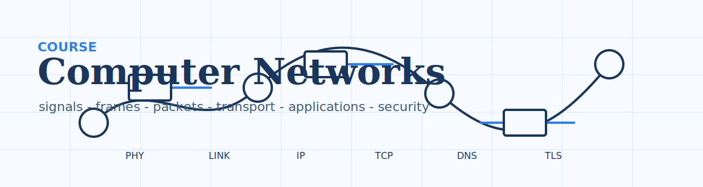

<p align="center">
  
</p>

<p align="center">
  <a href="LICENSE"></a>
  <a href="ROADMAP.md"></a>
  <a href="#contents"></a>
</p>

<p align="center"><sub>by <b>Ritesh Rana</b> &nbsp;·&nbsp; <a href="mailto:contact@riteshrana.engineer">contact@riteshrana.engineer</a></sub></p>

# Course: Computer Networks

Computer networks are layered systems with measurable behavior: signals, frames, packets, segments, names, requests, keys, timers, queues, and failures. This curriculum turns the supplied open networking material into a deep, packet-first course you can read, trace, build, and debug.

316 lessons (189 core + 127 planned expansions). 20 phases. ~345 hours. Every lesson ships a reusable artifact: a trace annotation, runbook, diagram, script, or study prompt.

## How This Works

The source material has been converted into chapter Markdown under [`chapters/`](chapters/). The course wraps that material in the same style as the AI Engineering course: many focused lessons, consistent folders, `docs/en.md`, `quiz.json`, runnable starters for build-heavy topics, and one reusable output artifact per lesson.

Each lesson follows the same loop:

1. Read the source section.
2. Build the mental model.
3. Inspect packet-level or measurement evidence.
4. Explain a failure mode.
5. Ship a reusable artifact.

## The Shape of the Curriculum

```mermaid
flowchart TB
  P0["Phase 0 - Networking Lab & Foundations"] --> P1["Phase 1 - Introduction & Network Architecture"]
  P1["Phase 1 - Introduction & Network Architecture"] --> P2["Phase 2 - Physical Layer & Transmission Systems"]
  P2["Phase 2 - Physical Layer & Transmission Systems"] --> P3["Phase 3 - Data Link Foundations"]
  P3["Phase 3 - Data Link Foundations"] --> P4["Phase 4 - Error Control & Link Protocols"]
  P4["Phase 4 - Error Control & Link Protocols"] --> P5["Phase 5 - Medium Access Protocols"]
  P5["Phase 5 - Medium Access Protocols"] --> P6["Phase 6 - Ethernet, Wireless LANs & Switching"]
  P6["Phase 6 - Ethernet, Wireless LANs & Switching"] --> P7["Phase 7 - Network Layer Design & Routing"]
  P7["Phase 7 - Network Layer Design & Routing"] --> P8["Phase 8 - Congestion, QoS & Internetworking"]
  P8["Phase 8 - Congestion, QoS & Internetworking"] --> P9["Phase 9 - Internet Protocols & IP Operations"]
  P9["Phase 9 - Internet Protocols & IP Operations"] --> P10["Phase 10 - Transport Services & Protocol Mechanics"]
  P10["Phase 10 - Transport Services & Protocol Mechanics"] --> P11["Phase 11 - TCP, UDP, Congestion & Performance"]
  P11["Phase 11 - TCP, UDP, Congestion & Performance"] --> P12["Phase 12 - DNS, Email & Web Protocols"]
  P12["Phase 12 - DNS, Email & Web Protocols"] --> P13["Phase 13 - Streaming, Real-Time Media & Content Delivery"]
  P13["Phase 13 - Streaming, Real-Time Media & Content Delivery"] --> P14["Phase 14 - Cryptography Foundations"]
  P14["Phase 14 - Cryptography Foundations"] --> P15["Phase 15 - Keys, Signatures & Authentication"]
  P15["Phase 15 - Keys, Signatures & Authentication"] --> P16["Phase 16 - Secure Communication & Web Security"]
  P16["Phase 16 - Secure Communication & Web Security"] --> P17["Phase 17 - Integrated Troubleshooting Labs"]
  P17["Phase 17 - Integrated Troubleshooting Labs"] --> P18["Phase 18 - Design & Production Network Labs"]
  P18["Phase 18 - Design & Production Network Labs"] --> P19["Phase 19 - Capstone Projects"]
```



## Getting Started

Open the roadmap, then start with Phase 0 if you want a lab-driven path. If you already know Wireshark, tcpdump, and basic layering, jump to Phase 1.

```bash
python phases/00-networking-lab-and-foundations/01-network-lab-environment/code/main.py
```

### Prerequisites

- Basic command-line comfort
- Willingness to inspect packet captures and protocol diagrams
- Python helps for the build labs, but the core course is language-independent

<a id="contents"></a>

## Contents

<details>
<summary><b>Phase 0 - Networking Lab & Foundations</b> &nbsp;<code>6 lessons</code>&nbsp; <em>Build the local lab, packet-reading habits, and measurement discipline used throughout the course.</em></summary>

| # | Lesson | Type | Lang |
|---|--------|------|------|
| 01 | [Network Lab Environment](phases/00-networking-lab-and-foundations/01-network-lab-environment/) | Build | Python, shell, Wireshark |
| 02 | [Packet Capture Workflow](phases/00-networking-lab-and-foundations/02-packet-capture-workflow/) | Build | Wireshark, tcpdump |
| 03 | [Reading RFCs and Standards to Layered Debugging Method](phases/00-networking-lab-and-foundations/03-reading-rfcs-and-standards-to-layered-debugging-method/) | Build | RFCs, standards, Python, shell |
| 04 | [Measurement Basics](phases/00-networking-lab-and-foundations/04-measurement-basics/) | Build | Python |
| 05 | [Trace Annotation Runbook](phases/00-networking-lab-and-foundations/05-trace-annotation-runbook/) | Build | Wireshark, Markdown |
| 06 | [Subnetting and Address Notation Primer to Course Portfolio Setup](phases/00-networking-lab-and-foundations/06-subnetting-and-address-notation-primer-to-course-portfolio-setup/) | Build | Python, shell, Markdown, Git |

</details>

<details>
<summary><b>Phase 1 - Introduction & Network Architecture</b> &nbsp;<code>10 lessons</code>&nbsp; <em>Map users, devices, standards, layers, and reference models before diving into protocols.</em></summary>

| # | Lesson | Type | Lang |
|---|--------|------|------|
| 01 | [Business Applications to Home Applications](phases/01-introduction-and-architecture/01-business-applications-to-home-applications/) | Learn | Diagrams, standards |
| 02 | [Mobile Users to Personal Area Networks](phases/01-introduction-and-architecture/02-mobile-users-to-personal-area-networks/) | Learn | Diagrams, standards |
| 03 | [Local Area Networks to Wide Area Networks](phases/01-introduction-and-architecture/03-local-area-networks-to-wide-area-networks/) | Learn | Diagrams, standards |
| 04 | [Internetworks to Design Issues for the Layers](phases/01-introduction-and-architecture/04-internetworks-to-design-issues-for-the-layers/) | Learn | Diagrams, standards |
| 05 | [Connection-Oriented Versus Connectionless Service to The Relationship of Services to Protocols](phases/01-introduction-and-architecture/05-connection-oriented-versus-connectionless-service-to-the-relationship-/) | Learn | Diagrams, standards |
| 06 | [The OSI Reference Model to The Model Used in This Book](phases/01-introduction-and-architecture/06-the-osi-reference-model-to-the-model-used-in-this-book/) | Learn | Diagrams, standards |
| 07 | [A Comparison of the OSI and TCP/IP Reference Models to A Critique of the TCP/IP Reference Model](phases/01-introduction-and-architecture/07-a-comparison-of-the-osi-and-tcp-ip-reference-models-to-a-critique-of-t/) | Learn | Diagrams, standards |
| 08 | [The Internet to Wireless LANs 802.11](phases/01-introduction-and-architecture/08-the-internet-to-wireless-lans-802-11/) | Learn | Diagrams, standards |
| 09 | [RFID and Sensor Networks to Who's Who in the International Standards World](phases/01-introduction-and-architecture/09-rfid-and-sensor-networks-to-who-s-who-in-the-international-standards-w/) | Learn | Diagrams, standards |
| 10 | [Who's Who in the Internet Standards World to Architecture Review Lab](phases/01-introduction-and-architecture/10-who-s-who-in-the-internet-standards-world-to-architecture-review-lab/) | Build | Diagrams, standards, Python, Markdown |

</details>

<details>
<summary><b>Phase 2 - Physical Layer & Transmission Systems</b> &nbsp;<code>12 lessons</code>&nbsp; <em>Study signals, media, modulation, multiplexing, telephony, mobile systems, and cable access.</em></summary>

| # | Lesson | Type | Lang |
|---|--------|------|------|
| 01 | [Fourier Analysis to The Maximum Data Rate of a Channel](phases/02-physical-layer-and-transmission-systems/01-fourier-analysis-to-the-maximum-data-rate-of-a-channel/) | Learn | Python, signal diagrams |
| 02 | [Magnetic Media to Coaxial Cable](phases/02-physical-layer-and-transmission-systems/02-magnetic-media-to-coaxial-cable/) | Learn | Python, signal diagrams |
| 03 | [Power Lines to The Electromagnetic Spectrum](phases/02-physical-layer-and-transmission-systems/03-power-lines-to-the-electromagnetic-spectrum/) | Learn | Python, signal diagrams |
| 04 | [Radio Transmission to Infrared Transmission](phases/02-physical-layer-and-transmission-systems/04-radio-transmission-to-infrared-transmission/) | Learn | Python, signal diagrams |
| 05 | [Light Transmission to Medium-Earth Orbit Satellites](phases/02-physical-layer-and-transmission-systems/05-light-transmission-to-medium-earth-orbit-satellites/) | Learn | Python, signal diagrams |
| 06 | [Low-Earth Orbit Satellites to Baseband Transmission](phases/02-physical-layer-and-transmission-systems/06-low-earth-orbit-satellites-to-baseband-transmission/) | Learn | Python, signal diagrams |
| 07 | [Passband Transmission to Time Division Multiplexing](phases/02-physical-layer-and-transmission-systems/07-passband-transmission-to-time-division-multiplexing/) | Learn | Python, signal diagrams |
| 08 | [Code Division Multiplexing to The Politics of Telephones](phases/02-physical-layer-and-transmission-systems/08-code-division-multiplexing-to-the-politics-of-telephones/) | Learn | Python, signal diagrams |
| 09 | [The Local Loop Modems, ADSL, and Fiber to Switching](phases/02-physical-layer-and-transmission-systems/09-the-local-loop-modems-adsl-and-fiber-to-switching/) | Learn | Python, signal diagrams |
| 10 | [First-Generation (1G) Mobile Phones Analog Voice to Third-Generation (3G) Mobile Phones Digital Voice and Data](phases/02-physical-layer-and-transmission-systems/10-first-generation-1g-mobile-phones-analog-voice-to-third-generation-3g-/) | Learn | Python, signal diagrams |
| 11 | [Community Antenna Television to Spectrum Allocation](phases/02-physical-layer-and-transmission-systems/11-community-antenna-television-to-spectrum-allocation/) | Learn | Python, signal diagrams |
| 12 | [Cable Modems to Modulation and Multiplexing Review Lab](phases/02-physical-layer-and-transmission-systems/12-cable-modems-to-modulation-and-multiplexing-review-lab/) | Build | Python, signal diagrams, shell |

</details>

<details>
<summary><b>Phase 3 - Data Link Foundations</b> &nbsp;<code>6 lessons</code>&nbsp; <em>Turn raw bit streams into frames with link services, framing, error control, and flow control.</em></summary>

| # | Lesson | Type | Lang |
|---|--------|------|------|
| 01 | [Services Provided to the Network Layer](phases/03-data-link-foundations/01-services-provided-to-the-network-layer/) | Learn | Wireshark, diagrams |
| 02 | [Framing](phases/03-data-link-foundations/02-framing/) | Learn | Wireshark, diagrams |
| 03 | [Error Control](phases/03-data-link-foundations/03-error-control/) | Learn | Wireshark, diagrams |
| 04 | [Flow Control](phases/03-data-link-foundations/04-flow-control/) | Learn | Wireshark, diagrams |
| 05 | [Frame Anatomy Lab](phases/03-data-link-foundations/05-frame-anatomy-lab/) | Build | Wireshark, Python |
| 06 | [Link-Layer Failure Modes](phases/03-data-link-foundations/06-link-layer-failure-modes/) | Build | Wireshark, runbooks |

</details>

<details>
<summary><b>Phase 4 - Error Control & Link Protocols</b> &nbsp;<code>8 lessons</code>&nbsp; <em>Build error-detection, correction, stop-and-wait, and sliding-window protocols from first principles.</em></summary>

| # | Lesson | Type | Lang |
|---|--------|------|------|
| 01 | [Error-Correcting Codes](phases/04-error-control-and-link-protocols/01-error-correcting-codes/) | Build | Python, Wireshark |
| 02 | [Error-Detecting Codes to A Utopian Simplex Protocol](phases/04-error-control-and-link-protocols/02-error-detecting-codes-to-a-utopian-simplex-protocol/) | Build | Python, Wireshark |
| 03 | [A Simplex Stop-and-Wait Protocol for an Error-Free Channel](phases/04-error-control-and-link-protocols/03-a-simplex-stop-and-wait-protocol-for-an-error-free-channel/) | Build | Python, Wireshark |
| 04 | [A Simplex Stop-and-Wait Protocol for a Noisy Channel to A One-Bit Sliding Window Protocol](phases/04-error-control-and-link-protocols/04-a-simplex-stop-and-wait-protocol-for-a-noisy-channel-to-a-one-bit-slid/) | Build | Python, Wireshark |
| 05 | [A Protocol Using Go-Back-N](phases/04-error-control-and-link-protocols/05-a-protocol-using-go-back-n/) | Build | Python, Wireshark |
| 06 | [A Protocol Using Selective Repeat to Packet over SONET](phases/04-error-control-and-link-protocols/06-a-protocol-using-selective-repeat-to-packet-over-sonet/) | Build | Python, Wireshark |
| 07 | [ADSL (asymmetric Digital Subscriber Loop)](phases/04-error-control-and-link-protocols/07-adsl-asymmetric-digital-subscriber-loop/) | Build | Python, Wireshark |
| 08 | [CRC and Checksum Lab to Sliding Window Simulator Lab](phases/04-error-control-and-link-protocols/08-crc-and-checksum-lab-to-sliding-window-simulator-lab/) | Build | Python |

</details>

<details>
<summary><b>Phase 5 - Medium Access Protocols</b> &nbsp;<code>7 lessons</code>&nbsp; <em>Coordinate shared media with ALOHA, CSMA, collision-free, limited-contention, and wireless MAC protocols.</em></summary>

| # | Lesson | Type | Lang |
|---|--------|------|------|
| 01 | [Static Channel Allocation](phases/05-medium-access-protocols/01-static-channel-allocation/) | Build | Python, models |
| 02 | [Assumptions for Dynamic Channel Allocation](phases/05-medium-access-protocols/02-assumptions-for-dynamic-channel-allocation/) | Build | Python, models |
| 03 | [ALOHA](phases/05-medium-access-protocols/03-aloha/) | Build | Python, models |
| 04 | [Carrier Sense Multiple Access Protocols to Collision-free Protocols](phases/05-medium-access-protocols/04-carrier-sense-multiple-access-protocols-to-collision-free-protocols/) | Build | Python, models |
| 05 | [Limited-Contention Protocols](phases/05-medium-access-protocols/05-limited-contention-protocols/) | Build | Python, models |
| 06 | [Wireless LAN Protocols](phases/05-medium-access-protocols/06-wireless-lan-protocols/) | Build | Python, models |
| 07 | [ALOHA and CSMA Simulator Lab to Wireless Hidden Terminal Lab](phases/05-medium-access-protocols/07-aloha-and-csma-simulator-lab-to-wireless-hidden-terminal-lab/) | Build | Python, Wireshark, diagrams |

</details>

<details>
<summary><b>Phase 6 - Ethernet, Wireless LANs & Switching</b> &nbsp;<code>14 lessons</code>&nbsp; <em>Inspect Ethernet, 802.11, broadband wireless, Bluetooth, RFID, bridges, switches, and VLANs.</em></summary>

| # | Lesson | Type | Lang |
|---|--------|------|------|
| 01 | [Classic Ethernet Physical Layer to Classic Ethernet MAC Sublayer Protocol](phases/06-ethernet-wireless-lans-and-switching/01-classic-ethernet-physical-layer-to-classic-ethernet-mac-sublayer-proto/) | Learn | Wireshark, diagrams |
| 02 | [Ethernet Performance to Fast Ethernet](phases/06-ethernet-wireless-lans-and-switching/02-ethernet-performance-to-fast-ethernet/) | Learn | Wireshark, diagrams |
| 03 | [Gigabit Ethernet to 10-gigabit Ethernet](phases/06-ethernet-wireless-lans-and-switching/03-gigabit-ethernet-to-10-gigabit-ethernet/) | Learn | Wireshark, diagrams |
| 04 | [Retrospective on Ethernet to The 802.11 Physical Layer](phases/06-ethernet-wireless-lans-and-switching/04-retrospective-on-ethernet-to-the-802-11-physical-layer/) | Learn | Wireshark, diagrams |
| 05 | [The 802.11 MAC Sublayer Protocol to The 802.11 Frame Structure](phases/06-ethernet-wireless-lans-and-switching/05-the-802-11-mac-sublayer-protocol-to-the-802-11-frame-structure/) | Learn | Wireshark, diagrams |
| 06 | [Services to The 802.16 Architecture and Protocol Stack](phases/06-ethernet-wireless-lans-and-switching/06-services-to-the-802-16-architecture-and-protocol-stack/) | Learn | Wireshark, diagrams |
| 07 | [The 802.16 Physical Layer to The 802.16 MAC Sublayer Protocol](phases/06-ethernet-wireless-lans-and-switching/07-the-802-16-physical-layer-to-the-802-16-mac-sublayer-protocol/) | Learn | Wireshark, diagrams |
| 08 | [The 802.16 Frame Structure to Bluetooth Applications](phases/06-ethernet-wireless-lans-and-switching/08-the-802-16-frame-structure-to-bluetooth-applications/) | Learn | Wireshark, diagrams |
| 09 | [The Bluetooth Protocol Stack to The Bluetooth Radio Layer](phases/06-ethernet-wireless-lans-and-switching/09-the-bluetooth-protocol-stack-to-the-bluetooth-radio-layer/) | Learn | Wireshark, diagrams |
| 10 | [The Bluetooth Link Layers to EPC Gen 2 Architecture](phases/06-ethernet-wireless-lans-and-switching/10-the-bluetooth-link-layers-to-epc-gen-2-architecture/) | Learn | Wireshark, diagrams |
| 11 | [EPC Gen 2 Physical Layer to EPC Gen 2 Tag Identification Layer](phases/06-ethernet-wireless-lans-and-switching/11-epc-gen-2-physical-layer-to-epc-gen-2-tag-identification-layer/) | Learn | Wireshark, diagrams |
| 12 | [Tag Identification Message Formats to Learning Bridges](phases/06-ethernet-wireless-lans-and-switching/12-tag-identification-message-formats-to-learning-bridges/) | Learn | Wireshark, diagrams |
| 13 | [Spanning Tree Bridges to Repeaters, Hubs, Bridges, Switches, Routers, and Gateways](phases/06-ethernet-wireless-lans-and-switching/13-spanning-tree-bridges-to-repeaters-hubs-bridges-switches-routers-and-g/) | Learn | Wireshark, diagrams |
| 14 | [Virtual LANs to Bridge Learning Table Lab](phases/06-ethernet-wireless-lans-and-switching/14-virtual-lans-to-bridge-learning-table-lab/) | Build | Wireshark, diagrams, Python |

</details>

<details>
<summary><b>Phase 7 - Network Layer Design & Routing</b> &nbsp;<code>14 lessons</code>&nbsp; <em>Route packets with datagrams, virtual circuits, shortest paths, distance vectors, link state, and multicast.</em></summary>

| # | Lesson | Type | Lang |
|---|--------|------|------|
| 01 | [Store-and-Forward Packet Switching](phases/07-network-layer-design-and-routing/01-store-and-forward-packet-switching/) | Build | Python, routing traces |
| 02 | [Services Provided to the Transport Layer](phases/07-network-layer-design-and-routing/02-services-provided-to-the-transport-layer/) | Build | Python, routing traces |
| 03 | [Implementation of Connectionless Service to Implementation of Connection-Oriented Service](phases/07-network-layer-design-and-routing/03-implementation-of-connectionless-service-to-implementation-of-connecti/) | Build | Python, routing traces |
| 04 | [Comparison of Virtual-Circuit and Datagram Networks](phases/07-network-layer-design-and-routing/04-comparison-of-virtual-circuit-and-datagram-networks/) | Build | Python, routing traces |
| 05 | [The Optimality Principle](phases/07-network-layer-design-and-routing/05-the-optimality-principle/) | Build | Python, routing traces |
| 06 | [Shortest Path Algorithm to Flooding](phases/07-network-layer-design-and-routing/06-shortest-path-algorithm-to-flooding/) | Build | Python, routing traces |
| 07 | [Distance Vector Routing](phases/07-network-layer-design-and-routing/07-distance-vector-routing/) | Build | Python, routing traces |
| 08 | [Link State Routing](phases/07-network-layer-design-and-routing/08-link-state-routing/) | Build | Python, routing traces |
| 09 | [Hierarchical Routing to Broadcast Routing](phases/07-network-layer-design-and-routing/09-hierarchical-routing-to-broadcast-routing/) | Build | Python, routing traces |
| 10 | [Multicast Routing](phases/07-network-layer-design-and-routing/10-multicast-routing/) | Build | Python, routing traces |
| 11 | [Anycast Routing](phases/07-network-layer-design-and-routing/11-anycast-routing/) | Build | Python, routing traces |
| 12 | [Routing for Mobile Hosts to Routing in Ad Hoc Networks](phases/07-network-layer-design-and-routing/12-routing-for-mobile-hosts-to-routing-in-ad-hoc-networks/) | Build | Python, routing traces |
| 13 | [Shortest Path Routing Lab](phases/07-network-layer-design-and-routing/13-shortest-path-routing-lab/) | Build | Python |
| 14 | [Distance Vector Failure Lab to Link State Flooding Lab](phases/07-network-layer-design-and-routing/14-distance-vector-failure-lab-to-link-state-flooding-lab/) | Build | Python |

</details>

<details>
<summary><b>Phase 8 - Congestion, QoS & Internetworking</b> &nbsp;<code>12 lessons</code>&nbsp; <em>Control congestion, shape traffic, schedule packets, connect networks, fragment packets, and reason about QoS.</em></summary>

| # | Lesson | Type | Lang |
|---|--------|------|------|
| 01 | [Approaches to Congestion Control](phases/08-congestion-qos-and-internetworking/01-approaches-to-congestion-control/) | Build | Python, packet traces |
| 02 | [Traffic-aware Routing to Admission Control](phases/08-congestion-qos-and-internetworking/02-traffic-aware-routing-to-admission-control/) | Build | Python, packet traces |
| 03 | [Traffic Throttling](phases/08-congestion-qos-and-internetworking/03-traffic-throttling/) | Build | Python, packet traces |
| 04 | [Load Shedding to Application Requirements](phases/08-congestion-qos-and-internetworking/04-load-shedding-to-application-requirements/) | Build | Python, packet traces |
| 05 | [Traffic Shaping](phases/08-congestion-qos-and-internetworking/05-traffic-shaping/) | Build | Python, packet traces |
| 06 | [Packet Scheduling to Admission Control](phases/08-congestion-qos-and-internetworking/06-packet-scheduling-to-admission-control/) | Build | Python, packet traces |
| 07 | [Integrated Services](phases/08-congestion-qos-and-internetworking/07-integrated-services/) | Build | Python, packet traces |
| 08 | [Differentiated Services to How Networks Differ](phases/08-congestion-qos-and-internetworking/08-differentiated-services-to-how-networks-differ/) | Build | Python, packet traces |
| 09 | [How Networks Can Be Connected](phases/08-congestion-qos-and-internetworking/09-how-networks-can-be-connected/) | Build | Python, packet traces |
| 10 | [Tunneling to Internetwork Routing](phases/08-congestion-qos-and-internetworking/10-tunneling-to-internetwork-routing/) | Build | Python, packet traces |
| 11 | [Packet Fragmentation](phases/08-congestion-qos-and-internetworking/11-packet-fragmentation/) | Build | Python, packet traces |
| 12 | [Queueing and Congestion Lab to Fragmentation and MTU Lab](phases/08-congestion-qos-and-internetworking/12-queueing-and-congestion-lab-to-fragmentation-and-mtu-lab/) | Build | Python, ping, tracepath |

</details>

<details>
<summary><b>Phase 9 - Internet Protocols & IP Operations</b> &nbsp;<code>10 lessons</code>&nbsp; <em>Work through IPv4, addressing, IPv6, ICMP/ARP/DHCP, MPLS, OSPF, BGP, multicast, and Mobile IP.</em></summary>

| # | Lesson | Type | Lang |
|---|--------|------|------|
| 01 | [The IP Version 4 Protocol](phases/09-internet-protocols-and-ip-operations/01-the-ip-version-4-protocol/) | Build | IP tools, Wireshark |
| 02 | [IP Addresses](phases/09-internet-protocols-and-ip-operations/02-ip-addresses/) | Build | IP tools, Wireshark |
| 03 | [IP Version 6](phases/09-internet-protocols-and-ip-operations/03-ip-version-6/) | Build | IP tools, Wireshark |
| 04 | [Internet Control Protocols to Label Switching and MPLS](phases/09-internet-protocols-and-ip-operations/04-internet-control-protocols-to-label-switching-and-mpls/) | Build | IP tools, Wireshark |
| 05 | [OSPF-an Interior Gateway Routing Protocol](phases/09-internet-protocols-and-ip-operations/05-ospf-an-interior-gateway-routing-protocol/) | Build | IP tools, Wireshark |
| 06 | [BGP-the Exterior Gateway Routing Protocol](phases/09-internet-protocols-and-ip-operations/06-bgp-the-exterior-gateway-routing-protocol/) | Build | IP tools, Wireshark |
| 07 | [Internet Multicasting to Mobile IP](phases/09-internet-protocols-and-ip-operations/07-internet-multicasting-to-mobile-ip/) | Build | IP tools, Wireshark |
| 08 | [IPv4 Header Decoder Lab](phases/09-internet-protocols-and-ip-operations/08-ipv4-header-decoder-lab/) | Build | Python |
| 09 | [Subnetting and CIDR Drill](phases/09-internet-protocols-and-ip-operations/09-subnetting-and-cidr-drill/) | Build | Python |
| 10 | [ICMP and Traceroute Lab to OSPF and BGP Policy Lab](phases/09-internet-protocols-and-ip-operations/10-icmp-and-traceroute-lab-to-ospf-and-bgp-policy-lab/) | Build | ping, traceroute, Wireshark, Diagrams |

</details>

<details>
<summary><b>Phase 10 - Transport Services & Protocol Mechanics</b> &nbsp;<code>10 lessons</code>&nbsp; <em>Build process-to-process communication with addressing, connection setup, reliability, buffering, and multiplexing.</em></summary>

| # | Lesson | Type | Lang |
|---|--------|------|------|
| 01 | [Services Provided to the Upper Layers](phases/10-transport-services-and-protocol-mechanics/01-services-provided-to-the-upper-layers/) | Build | Python, sockets |
| 02 | [Transport Service Primitives](phases/10-transport-services-and-protocol-mechanics/02-transport-service-primitives/) | Build | Python, sockets |
| 03 | [Berkeley Sockets](phases/10-transport-services-and-protocol-mechanics/03-berkeley-sockets/) | Build | Python, sockets |
| 04 | [An Example of Socket Programming an Internet File Server](phases/10-transport-services-and-protocol-mechanics/04-an-example-of-socket-programming-an-internet-file-server/) | Build | Python, sockets |
| 05 | [Addressing to Connection Establishment](phases/10-transport-services-and-protocol-mechanics/05-addressing-to-connection-establishment/) | Build | Python, sockets |
| 06 | [Connection Release](phases/10-transport-services-and-protocol-mechanics/06-connection-release/) | Build | Python, sockets |
| 07 | [Error Control and Flow Control](phases/10-transport-services-and-protocol-mechanics/07-error-control-and-flow-control/) | Build | Python, sockets |
| 08 | [Multiplexing](phases/10-transport-services-and-protocol-mechanics/08-multiplexing/) | Build | Python, sockets |
| 09 | [Crash Recovery](phases/10-transport-services-and-protocol-mechanics/09-crash-recovery/) | Build | Python, sockets |
| 10 | [Socket Lifecycle Lab to Reliable Transport State Machine Lab](phases/10-transport-services-and-protocol-mechanics/10-socket-lifecycle-lab-to-reliable-transport-state-machine-lab/) | Build | Python |

</details>

<details>
<summary><b>Phase 11 - TCP, UDP, Congestion & Performance</b> &nbsp;<code>13 lessons</code>&nbsp; <em>Trace UDP, TCP state, congestion control, performance limits, and delay-tolerant networking.</em></summary>

| # | Lesson | Type | Lang |
|---|--------|------|------|
| 01 | [Desirable Bandwidth Allocation to Regulating the Sending Rate](phases/11-tcp-udp-congestion-and-performance/01-desirable-bandwidth-allocation-to-regulating-the-sending-rate/) | Build | Python, Wireshark |
| 02 | [Wireless Issues to Introduction to UDP](phases/11-tcp-udp-congestion-and-performance/02-wireless-issues-to-introduction-to-udp/) | Build | Python, Wireshark |
| 03 | [Remote Procedure Call to Real-time Transport Protocols](phases/11-tcp-udp-congestion-and-performance/03-remote-procedure-call-to-real-time-transport-protocols/) | Build | Python, Wireshark |
| 04 | [Introduction to TCP to The TCP Service Model](phases/11-tcp-udp-congestion-and-performance/04-introduction-to-tcp-to-the-tcp-service-model/) | Build | Python, Wireshark |
| 05 | [The TCP Protocol to The TCP Segment Header](phases/11-tcp-udp-congestion-and-performance/05-the-tcp-protocol-to-the-tcp-segment-header/) | Build | Python, Wireshark |
| 06 | [TCP Connection Establishment to TCP Connection Release](phases/11-tcp-udp-congestion-and-performance/06-tcp-connection-establishment-to-tcp-connection-release/) | Build | Python, Wireshark |
| 07 | [TCP Connection Management Modeling to TCP Sliding Window](phases/11-tcp-udp-congestion-and-performance/07-tcp-connection-management-modeling-to-tcp-sliding-window/) | Build | Python, Wireshark |
| 08 | [TCP Timer Management to TCP Congestion Control](phases/11-tcp-udp-congestion-and-performance/08-tcp-timer-management-to-tcp-congestion-control/) | Build | Python, Wireshark |
| 09 | [The Future of TCP to Performance Problems in Computer Networks](phases/11-tcp-udp-congestion-and-performance/09-the-future-of-tcp-to-performance-problems-in-computer-networks/) | Build | Python, Wireshark |
| 10 | [Network Performance Measurement to Host Design for Fast Networks](phases/11-tcp-udp-congestion-and-performance/10-network-performance-measurement-to-host-design-for-fast-networks/) | Build | Python, Wireshark |
| 11 | [Fast Segment Processing to Header Compression](phases/11-tcp-udp-congestion-and-performance/11-fast-segment-processing-to-header-compression/) | Build | Python, Wireshark |
| 12 | [Protocols for Long Fat Networks to DTN Architecture](phases/11-tcp-udp-congestion-and-performance/12-protocols-for-long-fat-networks-to-dtn-architecture/) | Build | Python, Wireshark |
| 13 | [The Bundle Protocol to TCP Congestion Trace Lab](phases/11-tcp-udp-congestion-and-performance/13-the-bundle-protocol-to-tcp-congestion-trace-lab/) | Build | Python, Wireshark |

</details>

<details>
<summary><b>Phase 12 - DNS, Email & Web Protocols</b> &nbsp;<code>10 lessons</code>&nbsp; <em>Debug names, mail, web architecture, static and dynamic pages, HTTP, mobile web, and search.</em></summary>

| # | Lesson | Type | Lang |
|---|--------|------|------|
| 01 | [The DNS Name Space](phases/12-dns-email-and-web-protocols/01-the-dns-name-space/) | Build | dig, HTTP, Wireshark |
| 02 | [Domain Resource Records to Name Servers](phases/12-dns-email-and-web-protocols/02-domain-resource-records-to-name-servers/) | Build | dig, HTTP, Wireshark |
| 03 | [Architecture and Services](phases/12-dns-email-and-web-protocols/03-architecture-and-services/) | Build | dig, HTTP, Wireshark |
| 04 | [The User Agent to Message Formats](phases/12-dns-email-and-web-protocols/04-the-user-agent-to-message-formats/) | Build | dig, HTTP, Wireshark |
| 05 | [Message Transfer to Final Delivery](phases/12-dns-email-and-web-protocols/05-message-transfer-to-final-delivery/) | Build | dig, HTTP, Wireshark |
| 06 | [Architectural Overview](phases/12-dns-email-and-web-protocols/06-architectural-overview/) | Build | dig, HTTP, Wireshark |
| 07 | [Static Web Pages to Dynamic Web Pages and Web Applications](phases/12-dns-email-and-web-protocols/07-static-web-pages-to-dynamic-web-pages-and-web-applications/) | Build | dig, HTTP, Wireshark |
| 08 | [HTTP-the Hypertext Transfer Protocol](phases/12-dns-email-and-web-protocols/08-http-the-hypertext-transfer-protocol/) | Build | dig, HTTP, Wireshark |
| 09 | [The Mobile Web to Web Search](phases/12-dns-email-and-web-protocols/09-the-mobile-web-to-web-search/) | Build | dig, HTTP, Wireshark |
| 10 | [DNS Trace Lab to HTTP Request Lifecycle Lab](phases/12-dns-email-and-web-protocols/10-dns-trace-lab-to-http-request-lifecycle-lab/) | Build | dig, Wireshark, curl, browser tools |

</details>

<details>
<summary><b>Phase 13 - Streaming, Real-Time Media & Content Delivery</b> &nbsp;<code>23 lessons (8+15 planned)</code>&nbsp; <em>Understand audio/video encoding, streaming, conferencing, server farms, CDNs, and peer-to-peer distribution.</em></summary>

| # | Lesson | Type | Lang |
|---|--------|------|------|
| 01 | [Digital Audio](phases/13-streaming-real-time-media-and-content-delivery/01-digital-audio/) | Learn | Wireshark, diagrams |
| 02 | [Digital Video](phases/13-streaming-real-time-media-and-content-delivery/02-digital-video/) | Learn | Wireshark, diagrams |
| 03 | [Streaming Stored Media to Streaming Live Media](phases/13-streaming-real-time-media-and-content-delivery/03-streaming-stored-media-to-streaming-live-media/) | Learn | Wireshark, diagrams |
| 04 | [Real-time Conferencing](phases/13-streaming-real-time-media-and-content-delivery/04-real-time-conferencing/) | Learn | Wireshark, diagrams |
| 05 | [Content and Internet Traffic](phases/13-streaming-real-time-media-and-content-delivery/05-content-and-internet-traffic/) | Learn | Wireshark, diagrams |
| 06 | [Server Farms and Web Proxies to Content Delivery Networks](phases/13-streaming-real-time-media-and-content-delivery/06-server-farms-and-web-proxies-to-content-delivery-networks/) | Learn | Wireshark, diagrams |
| 07 | [Peer-to-peer Networks](phases/13-streaming-real-time-media-and-content-delivery/07-peer-to-peer-networks/) | Learn | Wireshark, diagrams |
| 08 | [Streaming Buffer Lab to CDN Path Analysis Lab](phases/13-streaming-real-time-media-and-content-delivery/08-streaming-buffer-lab-to-cdn-path-analysis-lab/) | Build | Python, dig, traceroute |
| 09 | [Perceptual Audio Coding (MP3, AAC)](phases/13-streaming-real-time-media-and-content-delivery/09-perceptual-audio-coding-mp3-aac/) | Learn | — |
| 10 | [JPEG Image Compression Pipeline](phases/13-streaming-real-time-media-and-content-delivery/10-jpeg-image-compression-pipeline/) | Learn | — |
| 11 | [MPEG Video I, P, B Frames](phases/13-streaming-real-time-media-and-content-delivery/11-mpeg-video-i-p-b-frames/) | Learn | — |
| 12 | [RTSP Streaming Session Setup](phases/13-streaming-real-time-media-and-content-delivery/12-rtsp-streaming-session-setup/) | Learn | — |
| 13 | [HTTP Adaptive Bitrate Streaming](phases/13-streaming-real-time-media-and-content-delivery/13-http-adaptive-bitrate-streaming/) | Learn | — |
| 14 | [RTP/RTCP Packet Trace Lab](phases/13-streaming-real-time-media-and-content-delivery/14-rtp-rtcp-packet-trace-lab/) | Learn | — |
| 15 | [Jitter Playout Buffering](phases/13-streaming-real-time-media-and-content-delivery/15-jitter-playout-buffering/) | Learn | — |
| 16 | [FEC and Interleaving Loss Recovery](phases/13-streaming-real-time-media-and-content-delivery/16-fec-and-interleaving-loss-recovery/) | Learn | — |
| 17 | [VoIP Packetization Delay Budget](phases/13-streaming-real-time-media-and-content-delivery/17-voip-packetization-delay-budget/) | Learn | — |
| 18 | [Multicast IGMP Live Media](phases/13-streaming-real-time-media-and-content-delivery/18-multicast-igmp-live-media/) | Learn | — |
| 19 | [SIP Session Setup and Redirection](phases/13-streaming-real-time-media-and-content-delivery/19-sip-session-setup-and-redirection/) | Learn | — |
| 20 | [H.323 Protocol Stack](phases/13-streaming-real-time-media-and-content-delivery/20-h323-protocol-stack/) | Learn | — |
| 21 | [Server Farm Load Balancing](phases/13-streaming-real-time-media-and-content-delivery/21-server-farm-load-balancing/) | Learn | — |
| 22 | [CDN DNS Redirection Edge Mapping](phases/13-streaming-real-time-media-and-content-delivery/22-cdn-dns-redirection-edge-mapping/) | Learn | — |
| 23 | [Chord DHT Finger Tables](phases/13-streaming-real-time-media-and-content-delivery/23-chord-dht-finger-tables/) | Learn | — |

</details>

<details>
<summary><b>Phase 14 - Cryptography Foundations</b> &nbsp;<code>30 lessons (10+20 planned)</code>&nbsp; <em>Learn classical crypto, one-time pads, DES, AES, cipher modes, public-key algorithms, and cryptanalysis.</em></summary>

| # | Lesson | Type | Lang |
|---|--------|------|------|
| 01 | [Introduction to Cryptography](phases/14-cryptography-foundations/01-introduction-to-cryptography/) | Build | Python, crypto diagrams |
| 02 | [Substitution Ciphers](phases/14-cryptography-foundations/02-substitution-ciphers/) | Build | Python, crypto diagrams |
| 03 | [Transposition Ciphers to One-time Pads](phases/14-cryptography-foundations/03-transposition-ciphers-to-one-time-pads/) | Build | Python, crypto diagrams |
| 04 | [Two Fundamental Cryptographic Principles](phases/14-cryptography-foundations/04-two-fundamental-cryptographic-principles/) | Build | Python, crypto diagrams |
| 05 | [DES-the Data Encryption Standard to AES-the Advanced Encryption Standard](phases/14-cryptography-foundations/05-des-the-data-encryption-standard-to-aes-the-advanced-encryption-standa/) | Build | Python, crypto diagrams |
| 06 | [Cipher Modes](phases/14-cryptography-foundations/06-cipher-modes/) | Build | Python, crypto diagrams |
| 07 | [Other Ciphers](phases/14-cryptography-foundations/07-other-ciphers/) | Build | Python, crypto diagrams |
| 08 | [Cryptanalysis to RSA](phases/14-cryptography-foundations/08-cryptanalysis-to-rsa/) | Build | Python, crypto diagrams |
| 09 | [Other Public-key Algorithms](phases/14-cryptography-foundations/09-other-public-key-algorithms/) | Build | Python, crypto diagrams |
| 10 | [Classical Cipher Lab to AES Mode Misuse Lab](phases/14-cryptography-foundations/10-classical-cipher-lab-to-aes-mode-misuse-lab/) | Build | Python |
| 11 | [Symmetric-key Digital Signatures and Big Brother](phases/14-cryptography-foundations/11-symmetric-key-digital-signatures-and-big-brother/) | Build | — |
| 12 | [Public-key Digital Signatures and Nonrepudiation](phases/14-cryptography-foundations/12-public-key-digital-signatures-and-nonrepudiation/) | Build | — |
| 13 | [Message Digests and One-way Hash Functions](phases/14-cryptography-foundations/13-message-digests-and-one-way-hash-functions/) | Build | — |
| 14 | [Building the SHA-1 Compression Function](phases/14-cryptography-foundations/14-building-the-sha-1-compression-function/) | Build | — |
| 15 | [The Birthday Attack on Message Digests](phases/14-cryptography-foundations/15-the-birthday-attack-on-message-digests/) | Build | — |
| 16 | [MD5 Collision Lab](phases/14-cryptography-foundations/16-md5-collision-lab/) | Build | — |
| 17 | [Digital Certificates and Certification Authorities](phases/14-cryptography-foundations/17-digital-certificates-and-certification-authorities/) | Build | — |
| 18 | [X.509 Certificates and ASN.1 Encoding](phases/14-cryptography-foundations/18-x509-certificates-and-asn1-encoding/) | Build | — |
| 19 | [Public Key Infrastructure and Chains of Trust](phases/14-cryptography-foundations/19-public-key-infrastructure-and-chains-of-trust/) | Build | — |
| 20 | [Certificate Revocation Lists Lab](phases/14-cryptography-foundations/20-certificate-revocation-lists-lab/) | Build | — |
| 21 | [IPsec Security Associations and the AH Header](phases/14-cryptography-foundations/21-ipsec-security-associations-and-the-ah-header/) | Build | — |
| 22 | [IPsec ESP in Transport and Tunnel Mode](phases/14-cryptography-foundations/22-ipsec-esp-in-transport-and-tunnel-mode/) | Build | — |
| 23 | [Packet Filter and Stateful Firewalls](phases/14-cryptography-foundations/23-packet-filter-and-stateful-firewalls/) | Build | — |
| 24 | [Virtual Private Networks over IPsec](phases/14-cryptography-foundations/24-virtual-private-networks-over-ipsec/) | Build | — |
| 25 | [WEP, WPA2 and the 802.11i Handshake](phases/14-cryptography-foundations/25-wep-wpa2-and-the-80211i-handshake/) | Build | — |
| 26 | [Challenge-Response Authentication and Reflection Attacks](phases/14-cryptography-foundations/26-challenge-response-authentication-and-reflection-attacks/) | Build | — |
| 27 | [Diffie-Hellman Key Exchange and the Man-in-the-Middle Attack](phases/14-cryptography-foundations/27-diffie-hellman-key-exchange-and-the-man-in-the-middle-attack/) | Build | — |
| 28 | [Kerberos V5 Authentication](phases/14-cryptography-foundations/28-kerberos-v5-authentication/) | Build | — |
| 29 | [DNS Spoofing and DNSSEC](phases/14-cryptography-foundations/29-dns-spoofing-and-dnssec/) | Build | — |
| 30 | [SSL/TLS Handshake and Record Protocol](phases/14-cryptography-foundations/30-ssl-tls-handshake-and-record-protocol/) | Build | — |

</details>

<details>
<summary><b>Phase 15 - Keys, Signatures & Authentication</b> &nbsp;<code>22 lessons (9+13 planned)</code>&nbsp; <em>Manage identity with signatures, digests, certificates, PKI, shared secrets, Diffie-Hellman, KDCs, Kerberos, and public-key auth.</em></summary>

| # | Lesson | Type | Lang |
|---|--------|------|------|
| 01 | [Symmetric-key Signatures](phases/15-keys-signatures-and-authentication/01-symmetric-key-signatures/) | Build | Python, protocol traces |
| 02 | [Public-key Signatures to Message Digests](phases/15-keys-signatures-and-authentication/02-public-key-signatures-to-message-digests/) | Build | Python, protocol traces |
| 03 | [The Birthday Attack](phases/15-keys-signatures-and-authentication/03-the-birthday-attack/) | Build | Python, protocol traces |
| 04 | [Certificates to X.509](phases/15-keys-signatures-and-authentication/04-certificates-to-x-509/) | Build | Python, protocol traces |
| 05 | [Public Key Infrastructures](phases/15-keys-signatures-and-authentication/05-public-key-infrastructures/) | Build | Python, protocol traces |
| 06 | [Authentication Based on a Shared Secret Key to Establishing a Shared Key the Diffie-hellman Key Exchange](phases/15-keys-signatures-and-authentication/06-authentication-based-on-a-shared-secret-key-to-establishing-a-shared-k/) | Build | Python, protocol traces |
| 07 | [Authentication Using a Key Distribution Center](phases/15-keys-signatures-and-authentication/07-authentication-using-a-key-distribution-center/) | Build | Python, protocol traces |
| 08 | [Authentication Using Kerberos to Authentication Using Public-key Cryptography](phases/15-keys-signatures-and-authentication/08-authentication-using-kerberos-to-authentication-using-public-key-crypt/) | Build | Python, protocol traces |
| 09 | [Certificate Chain Inspection Lab to Kerberos Message Flow Lab](phases/15-keys-signatures-and-authentication/09-certificate-chain-inspection-lab-to-kerberos-message-flow-lab/) | Build | openssl, browser tools, Diagrams, traces |
| 10 | [The Encryption Model And Kerckhoffs Principle](phases/15-keys-signatures-and-authentication/10-the-encryption-model-and-kerckhoffs-principle/) | Build | — |
| 11 | [Substitution And Transposition Ciphers](phases/15-keys-signatures-and-authentication/11-substitution-and-transposition-ciphers/) | Build | — |
| 12 | [One Time Pads And BB84 Quantum Key Distribution](phases/15-keys-signatures-and-authentication/12-one-time-pads-and-bb84-quantum-key-distribution/) | Build | — |
| 13 | [Redundancy And Freshness Cryptographic Principles](phases/15-keys-signatures-and-authentication/13-redundancy-and-freshness-cryptographic-principles/) | Build | — |
| 14 | [DES And Triple DES Block Cipher Internals](phases/15-keys-signatures-and-authentication/14-des-and-triple-des-block-cipher-internals/) | Build | — |
| 15 | [AES Rijndael Round Structure](phases/15-keys-signatures-and-authentication/15-aes-rijndael-round-structure/) | Build | — |
| 16 | [Block Cipher Modes ECB CBC CFB Counter](phases/15-keys-signatures-and-authentication/16-block-cipher-modes-ecb-cbc-cfb-counter/) | Build | — |
| 17 | [Cryptanalysis Differential Linear Power Timing](phases/15-keys-signatures-and-authentication/17-cryptanalysis-differential-linear-power-timing/) | Build | — |
| 18 | [RSA From Key Generation To Key Distribution](phases/15-keys-signatures-and-authentication/18-rsa-from-key-generation-to-key-distribution/) | Build | — |
| 19 | [Beyond RSA Knapsack Discrete Log Elliptic Curves](phases/15-keys-signatures-and-authentication/19-beyond-rsa-knapsack-discrete-log-elliptic-curves/) | Build | — |
| 20 | [SHA 1 SHA 2 And MD5 Digest Internals](phases/15-keys-signatures-and-authentication/20-sha-1-sha-2-and-md5-digest-internals/) | Build | — |
| 21 | [IPsec AH ESP Tunnel Transport Lab](phases/15-keys-signatures-and-authentication/21-ipsec-ah-esp-tunnel-transport-lab/) | Build | — |
| 22 | [PGP Message Construction And Key Rings](phases/15-keys-signatures-and-authentication/22-pgp-message-construction-and-key-rings/) | Build | — |

</details>

<details>
<summary><b>Phase 16 - Secure Communication & Web Security</b> &nbsp;<code>25 lessons (10+15 planned)</code>&nbsp; <em>Apply security to IPsec, firewalls, VPNs, wireless, email, secure naming, TLS, mobile code, and social issues.</em></summary>

| # | Lesson | Type | Lang |
|---|--------|------|------|
| 01 | [IPsec](phases/16-secure-communication-and-web-security/01-ipsec/) | Learn | openssl, browser tools, Wireshark |
| 02 | [Firewalls to Virtual Private Networks](phases/16-secure-communication-and-web-security/02-firewalls-to-virtual-private-networks/) | Learn | openssl, browser tools, Wireshark |
| 03 | [Wireless Security](phases/16-secure-communication-and-web-security/03-wireless-security/) | Learn | openssl, browser tools, Wireshark |
| 04 | [PGP-pretty Good Privacy to S/MIME](phases/16-secure-communication-and-web-security/04-pgp-pretty-good-privacy-to-s-mime/) | Learn | openssl, browser tools, Wireshark |
| 05 | [Threats](phases/16-secure-communication-and-web-security/05-threats/) | Learn | openssl, browser tools, Wireshark |
| 06 | [Secure Naming to SSL-the Secure Sockets Layer](phases/16-secure-communication-and-web-security/06-secure-naming-to-ssl-the-secure-sockets-layer/) | Learn | openssl, browser tools, Wireshark |
| 07 | [Mobile Code Security](phases/16-secure-communication-and-web-security/07-mobile-code-security/) | Learn | openssl, browser tools, Wireshark |
| 08 | [Privacy to Freedom of Speech](phases/16-secure-communication-and-web-security/08-privacy-to-freedom-of-speech/) | Learn | openssl, browser tools, Wireshark |
| 09 | [Copyright](phases/16-secure-communication-and-web-security/09-copyright/) | Learn | openssl, browser tools, Wireshark |
| 10 | [TLS Handshake Lab to Firewall Policy Review Lab](phases/16-secure-communication-and-web-security/10-tls-handshake-lab-to-firewall-policy-review-lab/) | Build | openssl, Wireshark, Diagrams, runbooks |
| 11 | [Symmetric Cipher Modes of Operation](phases/16-secure-communication-and-web-security/11-symmetric-cipher-modes-of-operation/) | Learn | — |
| 12 | [The Advanced Encryption Standard AES](phases/16-secure-communication-and-web-security/12-the-advanced-encryption-standard-aes/) | Learn | — |
| 13 | [The Data Encryption Standard and Cryptanalysis](phases/16-secure-communication-and-web-security/13-the-data-encryption-standard-and-cryptanalysis/) | Learn | — |
| 14 | [RSA the Math and the Attacks](phases/16-secure-communication-and-web-security/14-rsa-the-math-and-the-attacks/) | Learn | — |
| 15 | [Other Public-key Algorithms](phases/16-secure-communication-and-web-security/15-other-public-key-algorithms/) | Learn | — |
| 16 | [Message Digests and the Birthday Bound](phases/16-secure-communication-and-web-security/16-message-digests-and-the-birthday-bound/) | Learn | — |
| 17 | [Digital Signatures and HMACs](phases/16-secure-communication-and-web-security/17-digital-signatures-and-hmacs/) | Learn | — |
| 18 | [X.509 Certificates and PKI](phases/16-secure-communication-and-web-security/18-x509-certificates-and-pki/) | Learn | — |
| 19 | [Authentication with Shared Secret and Needham-Schroeder](phases/16-secure-communication-and-web-security/19-authentication-with-shared-secret-and-needham-schroeder/) | Learn | — |
| 20 | [Diffie-Hellman Key Exchange and the Man in the Middle](phases/16-secure-communication-and-web-security/20-diffie-hellman-key-exchange-and-the-man-in-the-middle/) | Learn | — |
| 21 | [Kerberos and Key Distribution Centers](phases/16-secure-communication-and-web-security/21-kerberos-and-key-distribution-centers/) | Learn | — |
| 22 | [Public-key Authentication Protocols](phases/16-secure-communication-and-web-security/22-public-key-authentication-protocols/) | Learn | — |
| 23 | [Substitution-Transposition and One-time Pads](phases/16-secure-communication-and-web-security/23-substitution-transposition-and-one-time-pads/) | Learn | — |
| 24 | [TLS Record Handshake and Cipher Suites](phases/16-secure-communication-and-web-security/24-tls-record-handshake-and-cipher-suites/) | Learn | — |
| 25 | [IPsec AH ESP and IKE Cross-cut Capstone](phases/16-secure-communication-and-web-security/25-ipsec-ah-esp-and-ike-cross-cut-capstone/) | Learn | — |

</details>

<details>
<summary><b>Phase 17 - Integrated Troubleshooting Labs</b> &nbsp;<code>28 lessons (7+21 planned)</code>&nbsp; <em>Combine layers into realistic packet-level investigations and operational runbooks.</em></summary>

| # | Lesson | Type | Lang |
|---|--------|------|------|
| 01 | [Physical-to-Application Outage Trace](phases/17-integrated-troubleshooting-labs/01-physical-to-application-outage-trace/) | Lab | Python, Wireshark |
| 02 | [DNS Works but HTTP Fails](phases/17-integrated-troubleshooting-labs/02-dns-works-but-http-fails/) | Lab | Wireshark, shell |
| 03 | [High Latency Video Call to Intermittent Wi-Fi Loss](phases/17-integrated-troubleshooting-labs/03-high-latency-video-call-to-intermittent-wi-fi-loss/) | Lab | Python, Wireshark, shell |
| 04 | [MTU Black Hole](phases/17-integrated-troubleshooting-labs/04-mtu-black-hole/) | Lab | Python, Wireshark |
| 05 | [TCP Retransmission Storm to TLS Certificate Failure](phases/17-integrated-troubleshooting-labs/05-tcp-retransmission-storm-to-tls-certificate-failure/) | Lab | Wireshark, shell, Python |
| 06 | [Routing Loop Investigation](phases/17-integrated-troubleshooting-labs/06-routing-loop-investigation/) | Lab | Wireshark, shell |
| 07 | [Slow Web Page Waterfall to Mail Delivery Failure](phases/17-integrated-troubleshooting-labs/07-slow-web-page-waterfall-to-mail-delivery-failure/) | Lab | Python, Wireshark, shell |
| 08 | [ARP Spoofing and Duplicate IP Conflict](phases/17-integrated-troubleshooting-labs/08-arp-spoofing-duplicate-ip-conflict/) | Lab | — |
| 09 | [NAT Port Exhaustion and Hairpin Loopback](phases/17-integrated-troubleshooting-labs/09-nat-port-exhaustion-hairpin-loopback/) | Lab | — |
| 10 | [Dual-Stack SLAAC and DHCPv6 Misconfig](phases/17-integrated-troubleshooting-labs/10-dual-stack-slaac-dhcpv6-misconfig/) | Lab | — |
| 11 | [BGP Route Leak and AS Path Forgery](phases/17-integrated-troubleshooting-labs/11-bgp-route-leak-as-path-forgery/) | Lab | — |
| 12 | [VLAN Trunk Mismatch and STP Root Bridge](phases/17-integrated-troubleshooting-labs/12-vlan-trunk-mismatch-stp-root-bridge/) | Lab | — |
| 13 | [Rogue DHCP Server Starvation](phases/17-integrated-troubleshooting-labs/13-rogue-dhcp-server-starvation/) | Lab | — |
| 14 | [HTTP/2 Coalescing Stream Deadlock](phases/17-integrated-troubleshooting-labs/14-http2-coalescing-stream-deadlock/) | Lab | — |
| 15 | [QUIC Connection Migration and CID NAT Rebind](phases/17-integrated-troubleshooting-labs/15-quic-connection-migration-cid-nat-rebind/) | Lab | — |
| 16 | [Forward Proxy CONNECT Tunnel and TLS Intercept](phases/17-integrated-troubleshooting-labs/16-forward-proxy-connect-tunnel-tls-intercept/) | Lab | — |
| 17 | [TLS SNI ALPN Certificate Chain Mismatch](phases/17-integrated-troubleshooting-labs/17-tls-sni-alpn-certificate-chain-mismatch/) | Lab | — |
| 18 | [TCP Spurious Retransmission Versus Loss](phases/17-integrated-troubleshooting-labs/18-tcp-spurious-retransmission-versus-loss/) | Lab | — |
| 19 | [ICMP Redirect, PMTUD, Blackhole DF](phases/17-integrated-troubleshooting-labs/19-icmp-redirect-pmtud-blackhole-df/) | Lab | — |
| 20 | [DNSSEC DS DNSKEY Chain Rollover Break](phases/17-integrated-troubleshooting-labs/20-dnssec-ds-dnskey-chain-rollover-break/) | Lab | — |
| 21 | [mDNS Zeroconf Name Conflict and Link-Local](phases/17-integrated-troubleshooting-labs/21-mdns-zeroconf-name-conflict-link-local/) | Lab | — |
| 22 | [WireGuard Handshake and Roaming Endpoint](phases/17-integrated-troubleshooting-labs/22-wireguard-handshake-roaming-endpoint/) | Lab | — |
| 23 | [IPv6 Extension Header and Fragment Firewall Drop](phases/17-integrated-troubleshooting-labs/23-ipv6-extension-header-fragment-firewall-drop/) | Lab | — |
| 24 | [ECN Marking, AQM, CoDel Congestion](phases/17-integrated-troubleshooting-labs/24-ecn-marking-aqm-codel-congestion/) | Lab | — |
| 25 | [VRF Namespace Blackhole and Asymmetric Routing](phases/17-integrated-troubleshooting-labs/25-vrf-namespace-blackhole-asymmetric-routing/) | Lab | — |
| 26 | [Ephemeral Port Exhaustion and TIME-WAIT Tuning](phases/17-integrated-troubleshooting-labs/26-ephemeral-port-exhaustion-time-wait-tuning/) | Lab | — |
| 27 | [High BDP Congestion Window Clamping](phases/17-integrated-troubleshooting-labs/27-high-bdp-congestion-window-clamping/) | Lab | — |
| 28 | [Multi-Layer Outage Forensics Capstone](phases/17-integrated-troubleshooting-labs/28-multi-layer-outage-forensics-capstone/) | Lab | — |

</details>

<details>
<summary><b>Phase 18 - Design & Production Network Labs</b> &nbsp;<code>30 lessons (7+23 planned)</code>&nbsp; <em>Design small networks, policy controls, measurements, monitoring, and production-ready network documentation.</em></summary>

| # | Lesson | Type | Lang |
|---|--------|------|------|
| 01 | [Small Campus Network Design](phases/18-design-and-production-network-labs/01-small-campus-network-design/) | Project | Python, shell |
| 02 | [Home Network Security Baseline](phases/18-design-and-production-network-labs/02-home-network-security-baseline/) | Project | Diagrams, Markdown |
| 03 | [Cloud VPC Connectivity Plan to Branch Office VPN Plan](phases/18-design-and-production-network-labs/03-cloud-vpc-connectivity-plan-to-branch-office-vpn-plan/) | Project | Python, shell, Diagrams, Markdown |
| 04 | [Monitoring and Alerting Runbook](phases/18-design-and-production-network-labs/04-monitoring-and-alerting-runbook/) | Project | Python, shell |
| 05 | [Address Plan and VLAN Design to QoS Policy for Voice and Video](phases/18-design-and-production-network-labs/05-address-plan-and-vlan-design-to-qos-policy-for-voice-and-video/) | Project | Diagrams, Markdown, Python, shell |
| 06 | [Incident Response Packet Kit](phases/18-design-and-production-network-labs/06-incident-response-packet-kit/) | Project | Diagrams, Markdown |
| 07 | [Network Documentation Portfolio to Production Readiness Review](phases/18-design-and-production-network-labs/07-network-documentation-portfolio-to-production-readiness-review/) | Project | Python, shell, Diagrams, Markdown |
| 08 | [OSPF Multi-Area Convergence and LSA Throttling](phases/18-design-and-production-network-labs/08-ospf-multi-area-convergence-and-lsa-throttling/) | Project | — |
| 09 | [BGP Multihoming with Two ISPs and AS-Path Prepending](phases/18-design-and-production-network-labs/09-bgp-multihoming-with-two-isps-and-as-path-prepending/) | Project | — |
| 10 | [RPKI Route Origin Validation and Route Leak Blocking](phases/18-design-and-production-network-labs/10-rpki-route-origin-validation-and-route-leak-blocking/) | Project | — |
| 11 | [Remote Triggered Blackhole for DDoS Scrubbing](phases/18-design-and-production-network-labs/11-remote-triggered-blackhole-for-ddos-scrubbing/) | Project | — |
| 12 | [Spine-Leaf Fabric with BGP EVPN and VXLAN](phases/18-design-and-production-network-labs/12-spine-leaf-fabric-with-bgp-evpn-and-vxlan/) | Project | — |
| 13 | [VRRP First-Hop Redundancy and Gateway Failover](phases/18-design-and-production-network-labs/13-vrrp-first-hop-redundancy-and-gateway-failover/) | Project | — |
| 14 | [DHCP Snooping Dynamic ARP Inspection and Port Security](phases/18-design-and-production-network-labs/14-dhcp-snooping-dynamic-arp-inspection-and-port-security/) | Project | — |
| 15 | [802.1X Wired Network Access Control with RADIUS](phases/18-design-and-production-network-labs/15-8021x-wired-network-access-control-with-radius/) | Project | — |
| 16 | [Anycast DNS with BIND and Health-Checked Zones](phases/18-design-and-production-network-labs/16-anycast-dns-with-bind-and-health-checked-zones/) | Project | — |
| 17 | [IPv6 Dual-Stack Rollout with SLAAC and DHCPv6 Prefix Delegation](phases/18-design-and-production-network-labs/17-ipv6-dual-stack-rollout-with-slaac-and-dhcpv6-prefix-delegation/) | Project | — |
| 18 | [HAProxy L7 Load Balancing with Health Checks and Session Affinity](phases/18-design-and-production-network-labs/18-haproxy-l7-load-balancing-with-health-checks-and-session-affinity/) | Project | — |
| 19 | [TLS Certificate Chain Debugging with OpenSSL and OCSP](phases/18-design-and-production-network-labs/19-tls-certificate-chain-debugging-with-openssl-and-ocsp/) | Project | — |
| 20 | [PIM-SM Multicast Routing for Live Video Distribution](phases/18-design-and-production-network-labs/20-pim-sm-multicast-routing-for-live-video-distribution/) | Project | — |
| 21 | [MPLS Segment Routing Traffic Engineering Tunnels](phases/18-design-and-production-network-labs/21-mpls-segment-routing-traffic-engineering-tunnels/) | Project | — |
| 22 | [NetFlow IPFIX Export and Flow-Based Traffic Accounting](phases/18-design-and-production-network-labs/22-netflow-ipfix-export-and-flow-based-traffic-accounting/) | Project | — |
| 23 | [Zero Trust Microsegmentation with Distributed Firewall Policies](phases/18-design-and-production-network-labs/23-zero-trust-microsegmentation-with-distributed-firewall-policies/) | Project | — |
| 24 | [DSCP Marking and LLQ QoS for Real-Time Traffic](phases/18-design-and-production-network-labs/24-dscp-marking-and-llq-qos-for-real-time-traffic/) | Project | — |
| 25 | [Syslog and NTP Correlated Logging Architecture](phases/18-design-and-production-network-labs/25-syslog-and-ntp-correlated-logging-architecture/) | Project | — |
| 26 | [Network Configuration Drift Detection with Ansible](phases/18-design-and-production-network-labs/26-network-configuration-drift-detection-with-ansible/) | Project | — |
| 27 | [Core Link Failure Chaos and Fast Reroute Convergence](phases/18-design-and-production-network-labs/27-core-link-failure-chaos-and-fast-reroute-convergence/) | Project | — |
| 28 | [Enterprise WPA3 and 802.1X Wireless Authentication Rollout](phases/18-design-and-production-network-labs/28-enterprise-wpa3-and-8021x-wireless-authentication-rollout/) | Project | — |
| 29 | [Production Cutover and Rollback Rehearsal with Traffic Simulation](phases/18-design-and-production-network-labs/29-production-cutover-and-rollback-rehearsal-with-traffic-simulation/) | Project | — |
| 30 | [Full-Scale Network Capstone Design and Operations Review](phases/18-design-and-production-network-labs/30-full-scale-network-capstone-design-and-operations-review/) | Project | — |

</details>

<details>
<summary><b>Phase 19 - Capstone Projects</b> &nbsp;<code>17 lessons (6+11 planned)</code>&nbsp; <em>Ship complete, portfolio-grade networking projects that prove end-to-end understanding.</em></summary>

| # | Lesson | Type | Lang |
|---|--------|------|------|
| 01 | [Protocol Trace Portfolio](phases/19-capstone-projects/01-protocol-trace-portfolio/) | Capstone | Python, shell |
| 02 | [Design a Small Campus Network](phases/19-capstone-projects/02-design-a-small-campus-network/) | Capstone | Diagrams, Wireshark |
| 03 | [Debug a Realistic Outage to Build a Minimal Reliable Protocol](phases/19-capstone-projects/03-debug-a-realistic-outage-to-build-a-minimal-reliable-protocol/) | Capstone | Python, shell, Diagrams, Wireshark |
| 04 | [Implement a Routing Simulator](phases/19-capstone-projects/04-implement-a-routing-simulator/) | Capstone | Python, shell |
| 05 | [Analyze an HTTPS Failure](phases/19-capstone-projects/05-analyze-an-https-failure/) | Capstone | Diagrams, Wireshark |
| 06 | [Design a Secure Remote Access Plan to Build a DNS and HTTP Diagnostic Tool](phases/19-capstone-projects/06-design-a-secure-remote-access-plan-to-build-a-dns-and-http-diagnostic-/) | Capstone | Python, shell, Diagrams, Wireshark |
| 07 | [Reconstruct TCP Congestion Control from a Pcap](phases/19-capstone-projects/07-reconstruct-tcp-congestion-control-from-a-pcap/) | Capstone | — |
| 08 | [Reverse Engineer an Unknown Application Protocol](phases/19-capstone-projects/08-reverse-engineer-an-unknown-application-protocol/) | Capstone | — |
| 09 | [Build and Verify a BGP Route Reflector Topology](phases/19-capstone-projects/09-build-and-verify-a-bgp-route-reflector-topology/) | Capstone | — |
| 10 | [Multicast IGMP Distribution Lab](phases/19-capstone-projects/10-multicast-igmp-distribution-lab/) | Capstone | — |
| 11 | [Isolated DHCP Starvation and ARP Poison Attack Chain](phases/19-capstone-projects/11-isolated-dhcp-starvation-and-arp-poison-attack-chain/) | Capstone | — |
| 12 | [Design an Anycast DNS HA Infrastructure](phases/19-capstone-projects/12-design-an-anycast-dns-ha-infrastructure/) | Capstone | — |
| 13 | [Demonstrate QUIC Connection Migration and Idle Timeout](phases/19-capstone-projects/13-demonstrate-quic-connection-migration-and-idle-timeout/) | Capstone | — |
| 14 | [TFRC UDP Media Rate Control](phases/19-capstone-projects/14-tfrc-udp-media-rate-control/) | Capstone | — |
| 15 | [Zero Trust Microsegmentation and Reachability Verification](phases/19-capstone-projects/15-zero-trust-microsegmentation-and-reachability-verification/) | Capstone | — |
| 16 | [sFlow IPFIX Telemetry and Anomaly Pipeline](phases/19-capstone-projects/16-sflow-ipfix-telemetry-and-anomaly-pipeline/) | Capstone | — |
| 17 | [Multilayer Incident Postmortem from Traffic and Logs](phases/19-capstone-projects/17-multilayer-incident-postmortem-from-traffic-and-logs/) | Capstone | — |

</details>

## Source Material

- [`open-source-computer-networks.md`](open-source-computer-networks.md) - full extracted Markdown
- [`chapters/`](chapters/) - chapter-level Markdown splits

## License

Course scaffolding is MIT licensed. Source text rights follow the source PDF/materials you supplied.
